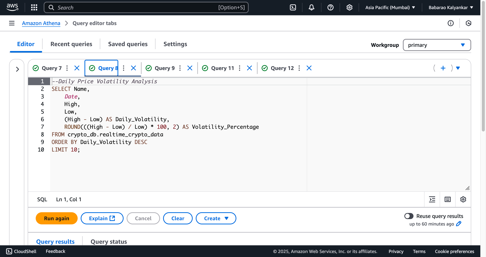
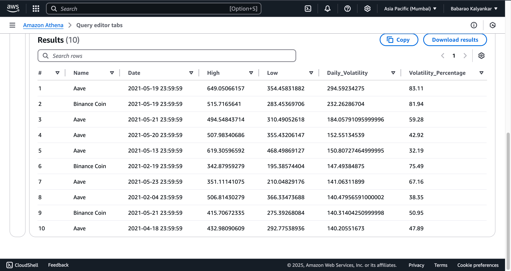

# Cryptocurrency Kafka Real-Time Data Engineering and Machine Learning Project

## Introduction
This project demonstrates an **End-To-End Data Engineering Pipeline** for processing real-time cryptocurrency market data using **Apache Kafka**, **AWS Cloud Services**, and modern data tools. The pipeline ingests live cryptocurrency prices, processes streams, stores data in a data lake, enables SQL analytics, and incorporates machine learning models for market trend predictions.

## Technology Stack
- **Programming Language**: Python 3.8+
- **Stream Processing**: Apache Kafka
- **Cloud Services** (AWS):
  - S3 (Data Lake Storage)
  - EC2 (Kafka Server)
  - Glue (Data Catalog)
  - Athena (SQL Analytics)
  - IAM (Security Configuration)
- **Machine Learning**:
  - CNN-RNN Models and XGBoost with **PySpark** on AWS for cryptocurrency price predictions
- **Data Tools**: Pandas, AWS CLI, Kafka-Python

## Dataset
Real-time cryptocurrency price data from multiple exchanges, containing:
- SNo
- Name
- Symbol
- Date
- High
- Low
- Open
- Close
- Volume
- Marketcap

Sample Dataset: [Cryptocurrency Historical Prices](https://www.kaggle.com/datasets/sudalairajkumar/cryptocurrencypricehistory)

## Machine Learning Models
- **CNN-RNN**: Combined Convolutional Neural Networks and Recurrent Neural Networks for sequential data analysis and market trend forecasting.
- **XGBoost**: A gradient boosting algorithm used for predictive analysis, applied to the processed cryptocurrency data for price predictions.

  **AWS Athena Query:**
  
   Daily Price Volatility Analysis
  
   
   

This pipeline also leverages machine learning to predict market trends and provide valuable insights.
